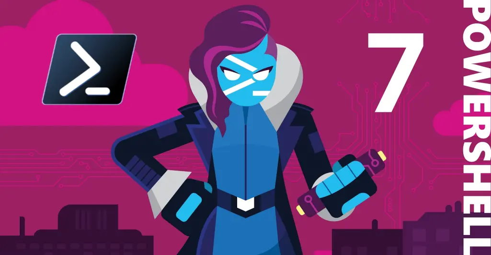

## RESOL AQUESTS REPTES, LLEGEIX LES INSTRUCCIONS DETALLADES ALS COMENTARIS DEL FITXER:
 - **01.ps1** Escriu "Hello World" en PowerShell
 - **02.ps1** Número d'usuaris locals
 - **03.ps1** Mostra el numero corresponent a la Build version de la versio PowerShell
 - **04.ps1** Es passa com a argument, en la crida de l'script, un numero enter i retorna 0 si es parell o 1 si es senar
 - **05.ps1** Crea un hashtable de nom $pops amb aquestes dades, pero els valors finals han de ser la xifra sumada al número corresponent al dia del mes del sistema.
 - **06.ps1** Número de processos del sistema que comencen per la lletra *w*
 - **07.ps1** Número de dies des del naixement de Nelson Mandela
 - **08.ps1** Retorna les lletres del string "supercalifragilisticoespialidoso" ordenades alfabéticament
 - **09.ps1** El fitxer usuarios.csv conté una taula amb usuaris i els seus corresponents passwords. Tot fent servir Import-Csv, llegeix aquest fitxer i itera'l per crear cada usuari amb el seu password.
 - **10.ps1** La invocació a aquest programa genera un array de nom $array format per dos números naturals: el primer està format pel nombre de paràmetres passats, i el segon per un número natural que és la mitjana arrodonida dels números passats per paràmetre.
